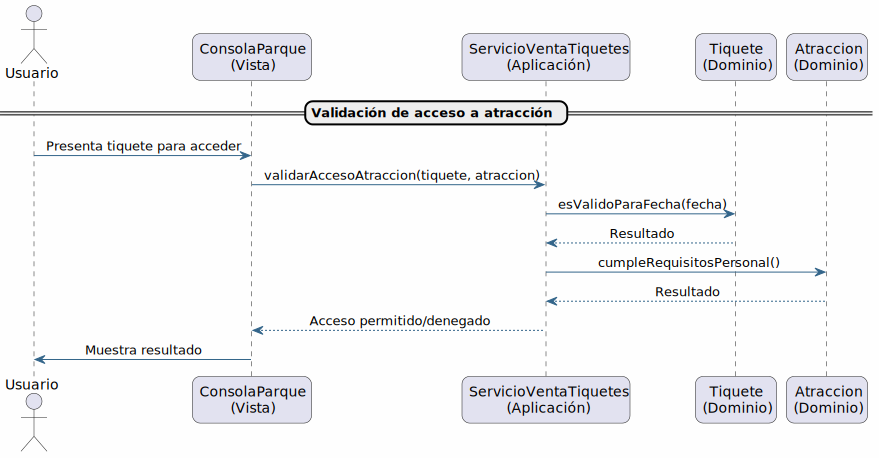
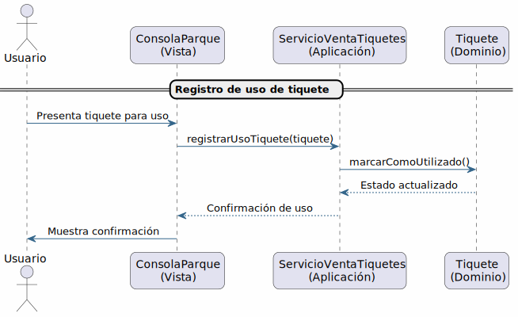
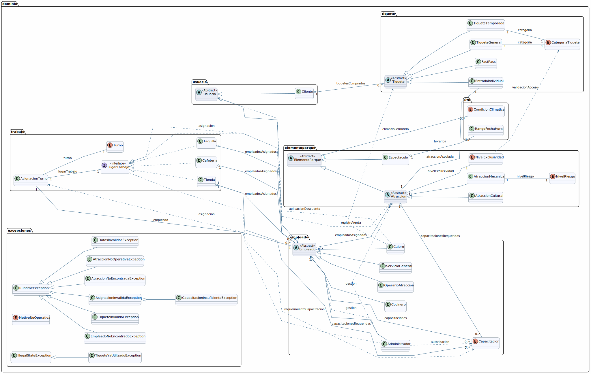
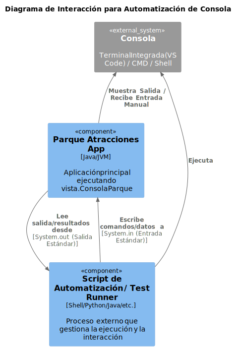

# DOCUMENTO DE DISEÑO DEL SISTEMA: PARQUE DE ATRACCIONES

**Filosofía de Diseño:** Este documento busca no solo presentar el diseño final del sistema del Parque de Atracciones, sino también ilustrar el *proceso* gradual e iterativo mediante el cual se llegó a él. El objetivo es **lograr consenso**, **compartir conocimiento** sobre las decisiones tomadas y asegurar que se consideran los aspectos importantes. Seguiremos un enfoque paso a paso, comenzando por la comprensión del problema, identificando roles y responsabilidades clave, y refinando la estructura progresivamente. Las decisiones de diseño se justificarán utilizando principios como la **reducción de complejidad**, la **previsión de cambios futuros**, el **bajo acoplamiento**, la **alta cohesión** y la **asignación cuidadosa de responsabilidades**, haciendo referencia a metodologías y patrones cuando sea apropiado. El diagrama de clases completo, resultado de este proceso, se presentará al final como culminación del razonamiento.

## 1. Comprensión del Problema: Contexto, Objetivos y Restricciones

### 1.1. Contexto
El sistema debe gestionar la operación diaria de un parque temático. Esto incluye el manejo de atracciones (sus tipos, estados, requisitos), los empleados que las operan (sus roles, capacitaciones, asignaciones), la venta y control de tiquetes para los visitantes (tipos, validaciones, uso), y la adaptación a diversas condiciones operativas (clima, mantenimiento, eventos especiales). Además, el parque cuenta con otros elementos como espectáculos, cafeterías, tiendas y taquillas que deben coexistir dentro del sistema, aunque su gestión detallada pueda variar en profundidad.

**Restricciones y Supuestos Iniciales:**
*   **Persistencia:** La información se almacenará y recuperará utilizando archivos en formato JSON. Esto implica diseñar mecanismos de serialización/deserialización.
*   **Interfaz:** La interacción principal con los usuarios (administradores, taquilleros) se realizará a través de una interfaz por consola.
*   **Alcance:** El foco inicial está en las operaciones centrales: tiquetes, personal esencial y operación de atracciones.

### 1.2. Objetivos Principales del Sistema (Requerimientos Funcionales Clave)
*   **Gestión de Tiquetes:** Permitir la compra (considerando tipos de usuario, posibles descuentos) y la validación de tiquetes para el acceso a atracciones o eventos. Registrar el uso efectivo de un tiquete.
*   **Gestión de Personal:** Administrar la información de los empleados (datos básicos, roles), sus capacitaciones específicas (qué atracciones/tareas pueden realizar) y sus asignaciones a turnos y lugares de trabajo.
*   **Gestión de Elementos del Parque:** Controlar el estado operativo de las atracciones (abierta, cerrada, en mantenimiento, requisitos de personal) basándose en factores como el clima, la seguridad y la disponibilidad de personal capacitado. Registrar información básica de otros elementos (espectáculos, tiendas).
*   **Operación Diaria:** Orquestar los flujos básicos como la apertura/cierre del parque, la asignación de personal al inicio del día, y la verificación de condiciones operativas.

### 1.3. No-Objetivos (Delimitación del Alcance Inicial)
Para **reducir la complejidad inicial** y enfocarnos en el núcleo, explícitamente dejamos fuera:
*   Interfaces gráficas de usuario (GUI) o web.
*   Integración en tiempo real con sistemas de pago externos.
*   Gestión detallada de inventarios (tiendas, cafeterías).
*   Sistemas complejos de reservas online o planificación avanzada de visitas.
*   Autenticación robusta o gestión de sesiones complejas (más allá de identificar tipos de usuario).

*(Estos no-objetivos son cruciales para mantener el diseño manejable y sostenible en las primeras iteraciones)*.

### 1.4. Consideraciones No Funcionales (Preliminares)
Aunque no se detallan exhaustivamente ahora, tenemos en mente:
*   **Mantenibilidad:** El diseño debe ser fácil de entender y modificar (**diseño sostenible**).
*   **Extensibilidad:** Debe ser relativamente sencillo añadir nuevos tipos de atracciones, tiquetes o reglas de negocio en el futuro (**pensar en los cambios**).
*   **Robustez:** El sistema debe manejar errores esperados (ej. tiquete inválido, empleado no capacitado) de forma controlada.

## 2. Identificación Inicial: Roles, Responsabilidades y Conceptos Clave

En esta fase exploratoria, identificamos los elementos fundamentales del dominio y las tareas principales que el sistema debe realizar, sin asignarlas aún a componentes específicos.

### 2.1. Conceptos Clave del Dominio (Entidades Potenciales)
*   Parque
*   ElementoParque (Generalización para Atracción, Espectáculo, Tienda, Cafetería, Taquilla)
*   Atracción
*   Empleado
*   Tiquete
*   Usuario/Cliente (Comprador/Visitante)
*   Turno/AsignaciónTrabajo
*   Capacitacion
*   CondicionOperativa (Clima, Mantenimiento, Seguridad)
*   RegistroUsoTiquete

### 2.2. Actores y Roles Principales
*   **Visitante/Cliente:** Interactúa para comprar tiquetes y usarlos en atracciones/servicios.
*   **Empleado (Operador):** Opera una atracción específica, realiza validaciones de tiquetes en el punto de acceso.
*   **Empleado (Taquillero):** Interactúa con el sistema para vender tiquetes a los clientes.
*   **Empleado (Supervisor/Administrador):** Gestiona datos de empleados, asigna turnos, supervisa el estado operativo general, gestiona excepciones.
*   **Sistema (Aplicación):** Orquesta los procesos, almacena y recupera información, aplica reglas de negocio, interactúa con la persistencia.

### 2.3. Responsabilidades Generales del Sistema (Tareas a Realizar)
*(Usamos descripciones **precisas** y evitamos verbos vagos como "manejar" o "gestionar" siempre que sea posible)*
*   Registrar y consultar información detallada de atracciones (tipo, capacidad, requisitos, estado).
*   Registrar y consultar información de empleados (datos personales, rol, capacitaciones asociadas).
*   Calcular el precio de un tiquete basado en tipo, cliente y promociones vigentes.
*   Emitir (crear y persistir) un nuevo tiquete con un identificador único.
*   Verificar la validez de un tiquete (fecha, tipo, si ya fue usado) para un acceso específico.
*   Marcar un tiquete como utilizado al acceder a una atracción/evento.
*   Crear y asignar turnos de trabajo a empleados para lugares específicos (atracciones, taquillas).
*   Verificar si un empleado posee la capacitación requerida para operar una atracción o realizar una tarea.
*   Evaluar y actualizar el estado operativo de una atracción (considerando personal asignado, condiciones climáticas, estado de mantenimiento).
*   Cargar el estado del parque desde la persistencia al iniciar.
*   Guardar el estado actual del parque a la persistencia periódicamente o al cerrar.
*   Informar errores de forma clara (ej., tiquete no válido, empleado no disponible, atracción cerrada).

*(Este listado representa el "qué" funcional. El siguiente paso es decidir el "quién" y el "cómo" dentro de la arquitectura del software)*.

## 🎢 3. Diseño Basado en Responsabilidades (RDD) y Estructura Arquitectónica

Adoptamos un enfoque basado en Responsabilidad-Driven Design (RDD) para asignar las tareas identificadas a componentes lógicos (clases/módulos). Buscamos crear un sistema donde cada componente tenga un propósito claro, encapsule su lógica interna y colabore eficazmente con otros.

### 3.1. Identificación de Roles y Asignación de Estereotipos

Para organizar el sistema y clarificar el propósito de cada parte, utilizamos estereotipos UML comunes que reflejan patrones arquitectónicos.

| Rol/Componente Lógico         | Estereotipo      | Responsabilidades Principales (Know/Do/Decide)                                                                                                | Colaboradores Clave                                  |
|-------------------------------|------------------|-----------------------------------------------------------------------------------------------------------------------------------------------|------------------------------------------------------|
| **Consola-Parque**           | `<<boundary>>`   | **Do:** Presentar información al usuario, capturar entradas del usuario. **Know:** Formato de E/S.                                              | Servicios de Aplicación                              |
| **ServicioVentaTiquetes**     | `<<control>>`    | **Do:** Orquestar la venta, validación y uso de tiquetes. **Decide:** Aplicar reglas de negocio de venta/validación. **Know:** Flujo de venta/uso. | RepositorioTiquetes, Tiquete, Atraccion, TiqueteFactory |
| **ServicioGestionEmpleados**  | `<<control>>`    | **Do:** Orquestar la gestión de empleados, capacitaciones y asignación de turnos. **Decide:** Validar asignaciones. **Know:** Flujo de RRHH.     | RepositorioEmpleados, RepositorioTurnos, Empleado, TurnoFactory |
| **ServicioGestionElementos**  | `<<control>>`    | **Do:** Orquestar la gestión del estado de atracciones y otros elementos. **Decide:** Evaluar condiciones operativas. **Know:** Estado del parque. | RepositorioElementosParque, ElementoParque, Atraccion |
| **Tiquete**                   | `<<entity>>`     | **Know:** Su ID, tipo, fecha, estado (usado/no usado). **Do:** Marcarse como usado. **Decide:** Si es válido para una fecha/atracción.          | ServicioVentaTiquetes, RepositorioTiquetes           |
| **Empleado**                  | `<<entity>>`     | **Know:** Sus datos, rol, capacitaciones. **Do:** -. **Decide:** Si está capacitado para un elemento.                                          | ServicioGestionEmpleados, RepositorioEmpleados       |
| **Atraccion** (ElementoParque)| `<<entity>>`     | **Know:** Su estado operativo, requisitos, capacidad. **Do:** Actualizar su estado. **Decide:** Si permite acceso (basado en estado).         | ServicioGestionElementos, ServicioVentaTiquetes      |
| **Repositorio\* **            | `<<infrastructure>>`| **Do:** Persistir y recuperar entidades (Tiquetes, Empleados, etc.). **Know:** Detalles de almacenamiento (JSON). **Decide:** -.             | Servicios de Aplicación, JSONMapper                  |
| **\*Factory**                 | `<<factory>>`    | **Do:** Crear instancias complejas de entidades (Tiquetes, Turnos). **Know:** Lógica de construcción. **Decide:** -.                          | Servicios de Aplicación                              |
| **JSONMapper**                | `<<infrastructure>>`| **Do:** Convertir objetos Java a/desde formato JSON. **Know:** Reglas de mapeo. **Decide:** -.                                             | Repositorios                                         |

**Justificación de Estereotipos:**
*   `<<boundary>>`: Separa la lógica de interacción con el exterior(la consola) del núcleo de la aplicación.
*   `<<control>>`: Encapsula la lógica de orquestación de los casos de uso, coordinando las entidades y la infraestructura. Mantiene el dominio limpio de lógica de aplicación.
*   `<<entity>>`: Representa los objetos clave del dominio con sus datos y lógica intrínseca. Son el corazón del modelo.
*   `<<infrastructure>>`: Aísla las dependencias técnicas (como la persistencia JSON) del resto del sistema, facilitando cambios futuros.
*   `<<factory>>`: Centraliza la creación de objetos complejos, promoviendo la cohesión y simplificando los servicios.

### 3.2. Colaboraciones Clave y Flujos de Control (Diagramas de Secuencia)

Los diagramas de secuencia ilustran cómo estos roles colaboran para cumplir con las responsabilidades del sistema. A continuación, se presentan algunos flujos críticos:

**1. Venta de un Tiquete:**
*   El `InterfazUsuario` captura los datos.
*   El `ServicioVentaTiquetes` orquesta: usa un `TiqueteFactory` para crear el `Tiquete` y luego lo persiste usando el `RepositorioTiquetes`.

*(Nota: Este diagrama ilustra el flujo típico de venta).*

**2. Validación de Acceso a una Atracción:**
*   Un `OperadorAtraccionUI` (o similar) inicia la validación.
*   El `ServicioVentaTiquetes` recupera el `Tiquete` y la `Atraccion` (vía `ServicioGestionElementosParque` y sus repositorios).
*   Delega la validación inicial al `Tiquete` (`esValidoPara`).
*   Si es válido, consulta a la `Atraccion` (`permiteAcceso`).
*   Si todo es correcto, marca el `Tiquete` como usado y lo guarda.

*(Nota: Este diagrama refleja la lógica observada para validar un tiquete en una atracción específica).*

**3. Asignación de Turno a un Empleado:**
*   El `InterfazUsuario` captura los detalles de la asignación.
*   El `ServicioGestionEmpleados` recupera el `Empleado` y el `ElementoParque` (Atracción).
*   Verifica si el `Empleado` está capacitado (`puedeTrabajarEn`).
*   Si es apto, usa un `TurnoFactory` para crear el `Turno` y lo persiste con `RepositorioTurnos`.

*(Nota: Diagrama basado en el flujo esperado para asignar un empleado a un turno).*

**4. Registrar Uso de Tiquete (Post-Validación):**
*   Como parte de la validación exitosa, el `ServicioVentaTiquetes` recupera el `Tiquete`.
*   Invoca `marcarComoUsado()` en el `Tiquete`.
*   Persiste el cambio usando `RepositorioTiquetes`.

*(Nota: Este diagrama detalla el paso específico de marcar un tiquete como usado, usualmente tras una validación).*

**5. Cambio de Estado de una Atracción:**
*   El `InterfazUsuario` solicita el cambio.
*   El `ServicioGestionElementosParque` recupera la `Atraccion`.
*   Invoca `actualizarEstado()` en la `Atraccion`.
*   Persiste el cambio usando `RepositorioElementosParque`.

*(Nota: Ilustra cómo se gestiona un cambio en el estado operativo de un elemento del parque).*

### 3.3. Estilo de Control: Delegado

El sistema adopta predominantemente un **Estilo de Control Delegado**.
*   Los **Servicios de Aplicación** (`<<control>>`) actúan como coordinadores principales para los casos de uso iniciados desde la interfaz. Reciben las solicitudes y conocen los pasos generales para completarlas.
*   Sin embargo, **no centralizan toda la lógica**. Delegan responsabilidades significativas a los objetos del **Dominio** (`<<entity>>`). Por ejemplo, el `Tiquete` decide sobre su propia validez, y el `Empleado` sobre sus capacitaciones.
*   Los **Repositorios** (`<<infrastructure>>`) se encargan exclusivamente de la persistencia, abstraídos mediante interfaces.

**Ventajas de este enfoque:**
*   **Alta Cohesión:** Las clases del dominio encapsulan datos y la lógica directamente relacionada con ellos. Los servicios se centran en la orquestación.
*   **Bajo Acoplamiento:** Los servicios dependen de abstracciones (interfaces de repositorios, métodos públicos del dominio), no de detalles internos. El dominio no conoce la infraestructura ni la interfaz de usuario.
*   **Mejor Testeabilidad:** Las entidades del dominio se pueden probar de forma aislada. Los servicios se pueden probar usando mocks para sus dependencias (repositorios, otras entidades).
*   **Mayor Mantenibilidad y Extensibilidad:** Los cambios en la lógica de negocio de una entidad (ej. nueva regla de validez de tiquete) se localizan principalmente en esa clase. Añadir nuevos casos de uso implica crear o modificar servicios sin necesariamente alterar drásticamente el dominio existente.

**Alternativa Considerada:** Un estilo *Centralizado*, donde los servicios contendrían casi toda la lógica, fue descartado porque llevaría a un "Modelo de Dominio Anémico" (clases de dominio como simples contenedores de datos) y a servicios muy grandes, complejos y difíciles de mantener (baja cohesión, alto acoplamiento).

## 💡 4. Consideraciones de Diseño y Principios Aplicados (Análisis Detallado)

En la primera iteración de nuestro diseño contemplamos la creación de una clase `Parque` encargada de orquestar toda la aplicación, desde la venta de tiquetes hasta la asignación de empleados y el control de atracciones. Pronto detectamos que este esquema derivaba en una **clase Dios**: concentraba demasiadas responsabilidades, dificultaba la prueba y generaba un acoplamiento excesivo. Por ello, descartamos ese enfoque y evolucionamos hacia el diseño actual, basado en:
- Servicios de aplicación (`<<control>>`) que coordinan casos de uso.
- Entidades del dominio (`<<entity>>`) con su propia lógica.
- Repositorios e infraestructuras aisladas (`<<infrastructure>>`) para persistencia.

Evaluamos cómo el diseño actual aborda las recomendaciones clave:

*   **Reducción de Complejidad:** La arquitectura en capas (UI, Aplicación, Dominio, Infraestructura) y la división en componentes cohesivos (`ServicioVentaTiquetes`, `ServicioGestionPersonal`) descomponen el problema en partes más pequeñas y manejables. Las clases del dominio (`Tiquete`, `Empleado`) son relativamente simples y enfocadas. Se **prefirieron diseños simples** sobre soluciones inicialmente más generéricas pero complejas.
    *Ejemplo concreto:* La clase `Tiquete` solo conoce su propio estado y reglas de validez, mientras que la lógica de coordinación y persistencia está en los servicios y repositorios, evitando clases "Dios".*
*   **Pensar en los Cambios (Flexibilidad y Modularidad):**
    *   **Cambio de Persistencia:** Solo requeriría nuevas implementaciones de las interfaces de Repositorio en la capa de Infraestructura. El Dominio y los Servicios de Aplicación no se verían afectados gracias al **Dependency Inversion Principle**.
        *Ejemplo concreto:* Si se cambia de archivos JSON a una base de datos MongoDB, solo se implementa un nuevo `RepositorioTiquetesMongo`, sin modificar el dominio ni los servicios.*
    *   **Nuevos Tipos de Tiquetes/Atracciones:** La herencia y el polimorfismo permiten añadir subclases (`TiqueteVIP`, `AtraccionVirtual`) con impacto localizado. Si se usa el patrón Strategy para reglas de negocio, añadir nuevas reglas es aún más sencillo.
    *   **Soportar HTTP-POST:** Se añadiría una nueva capa de `Adaptadores` que traduciría las peticiones HTTP a llamadas a los `ServiciosAplicacion` existentes. La lógica de negocio central permanecería intacta.
    *   **Mecanismo de Autenticación:** Se podría introducir un nuevo servicio (`ServicioAutenticacion`) y modificar la capa de `InterfazUsuario` (o el nuevo adaptador web) para interactuar con él antes de permitir el acceso a los servicios de aplicación.
    *Alternativa considerada:* Se evaluó acoplar la lógica de persistencia directamente en los servicios, pero esto habría dificultado el cambio de tecnología y las pruebas.*
*   **Reducción del Acoplamiento:**
    *   **Entre Capas:** Las dependencias van en una sola dirección (UI -> Aplicación -> Dominio -> Infraestructura - con inversión para repositorios).
    *   **Dentro de Capas:** Los servicios dependen de interfaces (`RepositorioTiquetes`), no de clases concretas. Las colaboraciones se diseñan en términos de contratos (métodos públicos), no de detalles internos (**encapsulamiento**).
    *   *Ejemplo Concreto:* `Atraccion` no necesita saber *cómo* se guarda un `Tiquete` en JSON, solo interactúa con `ServicioValidacion` a través de su interfaz definida. Un cambio en la serialización JSON no afecta a `Atraccion`.
*   **Preferencia por Inyección de Dependencias (DI):**
    *   Como se mencionó, las dependencias (repositorios, factories, otros servicios) se inyectan en los servicios que las necesitan (usualmente vía constructor).
    *   *Ventaja:* **Desacopla** las clases de la responsabilidad de *crear* o *localizar* sus dependencias. Facilita la **sustitución** de dependencias (vital para pruebas unitarias con mocks/stubs). Evita dependencias ocultas a través de singletons globales o Service Locators, haciendo la estructura más explícita y manejable.
    *Ejemplo concreto:* `ServicioVentaTiquetes` recibe un `RepositorioTiquetes` y un `TiqueteFactory` por constructor, permitiendo inyectar mocks en pruebas.*
*   **Estilo de Control (Delegado):**
    *   Se eligió un estilo **Delegado**. Los `ServiciosAplicacion` actúan como coordinadores principales para los casos de uso, pero no contienen *toda* la lógica.
    *   Los objetos del `Dominio` (`Atraccion`, `Tiquete`, `Empleado`) tienen inteligencia propia y participan activamente en la ejecución de las responsabilidades (ej. `Tiquete.marcarComoUsado()`, `Atraccion.estaOperativa()`).
    *   *Ventajas en este contexto:* Buen balance. Evita los "Controladores Anémicos" (donde el dominio no tiene lógica) y los "Controladores Dios" (donde un servicio lo hace todo, volviéndose complejo y frágil). Promueve **mayor cohesión** en el dominio y **menor acoplamiento** entre servicios y dominio comparado con un estilo puramente centralizado. Es más fácil **distribuir el trabajo de desarrollo**.
    *   *Desventajas potenciales:* Requiere un diseño cuidadoso de las colaboraciones para que no se vuelvan excesivamente complejas ("demasiados mensajes").
    *Alternativa considerada:* Un control totalmente centralizado en los servicios fue descartado para evitar baja cohesión y dificultad de extensión.*

## 5. Diseño Detallado: El Diagrama de Clases Resultante

Este diagrama es la síntesis visual del proceso iterativo descrito, reflejando la estructura, clases, relaciones y responsabilidades asignadas.

### 🗂️ 5.1. Diagrama de Clases de Alto Nivel
Ofrece una visión simplificada de las principales clases y sus relaciones fundamentales, útil para entender la macro-estructura.

### 🧩 5.2. Diagrama de Clases Detallado
Presenta la estructura completa con atributos clave, métodos importantes y todas las relaciones (herencia, asociación, dependencia). Es el artefacto principal que guiará la implementación.

## 💾 6. Detalles Adicionales: Persistencia y Manejo de Excepciones

### 🗄️ 6.1. Infraestructura de Persistencia (Patrón Repositorio)
*   El **Patrón Repositorio** abstrae la lógica de acceso a datos. Los servicios de aplicación interactúan con interfaces como `RepositorioTiquetes`.
*   Las implementaciones concretas (`RepositorioTiquetesJSON`) usan **Mappers** y/o **DTOs (Data Transfer Objects)** para convertir entre los objetos ricos del dominio y la representación plana de JSON, evitando que el dominio se contamine con detalles de persistencia.
*   **Consideración Futura:** Si se migra a una base de datos, se podrían introducir conceptos como **Unidad de Trabajo (Unit of Work)** para gestionar transacciones.

### 🚨 6.2. Manejo de Errores (Jerarquía de Excepciones)
*   Se utiliza una **jerarquía de excepciones personalizadas** (ej. `TiqueteInvalidoException`, `EmpleadoNoCapacitadoException`, `AtraccionNoOperativaException`) que heredan de una excepción base del sistema (`ParqueAtraccionesException`).
*   Esto permite a las capas superiores (Servicios, UI) capturar errores específicos y reaccionar adecuadamente (ej. mostrar un mensaje claro al usuario). Favorece un manejo de errores **robusto y predecible**.
*   Se complementa con logging adecuado en puntos críticos.

## 📊 Macro-diagrama de Arquitectura por Capas

El siguiente macro-diagrama sintetiza la relación entre las capas principales del sistema, mostrando cómo la Interfaz de Usuario, la Aplicación, el Dominio y la Infraestructura colaboran para soportar los requerimientos críticos. Este diagrama ayuda a visualizar la separación de responsabilidades y el flujo de dependencias, facilitando la comprensión global del diseño:

Cada capa tiene responsabilidades bien definidas:
- **Interfaz de Usuario:** Interactúa con el usuario final y traduce sus acciones en solicitudes para la aplicación.
- **Aplicación:** Orquesta los casos de uso, coordinando entidades de dominio y persistencia.
- **Dominio:** Contiene la lógica de negocio central y las entidades inteligentes.
- **Infraestructura:** Implementa detalles técnicos como persistencia y mapeo de datos.

---

## 7. Ejecución e Interacción con la Consola

La aplicación `parque-atracciones` utiliza `vista.ConsolaParque` como su punto de entrada principal y la interfaz primaria para la interacción. El diseño se basa en la comunicación estándar a través de la consola:

*   **Entrada:** `ConsolaParque` lee los comandos y datos del usuario desde la entrada estándar (`System.in`), utilizando `java.util.Scanner`.
*   **Salida:** Muestra los menús, resultados de operaciones, mensajes de estado y errores directamente en la salida estándar (`System.out`).

Este enfoque, implementado en el proyecto, permite dos modos de operación:

1.  **Interacción Manual:** Los usuarios pueden ejecutar la aplicación (por ejemplo, usando `mvn exec:java` o mediante la configuración de ejecución del IDE) e interactuar directamente escribiendo comandos en la consola y observando la salida.
2.  **Automatización y Pruebas:** La dependencia de `System.in` y `System.out` es clave para la automatización implementada. Un proceso externo, como los scripts de prueba o las configuraciones de ejecución que hemos utilizado, puede:
    *   Iniciar la aplicación `parque-atracciones`.
    *   Enviar secuencias de comandos (inputs) predefinidas a la entrada estándar (`System.in`) de la aplicación.
    *   Capturar y analizar la salida estándar (`System.out`) para verificar que la aplicación se comporta según lo esperado y produce los resultados correctos para cada escenario.

Esta capacidad ha sido fundamental durante el desarrollo y la validación del sistema, permitiendo ejecutar escenarios de prueba complejos de forma repetible y verificable, como se demostró en nuestra discusión sobre la automatización de los casos de uso.

El siguiente diagrama ilustra específicamente cómo esta interacción funciona en el contexto del proyecto:

*(Nota: Este diagrama muestra cómo un proceso externo, como un script de prueba, controla y observa la aplicación `parque-atracciones` a través de sus flujos estándar de entrada/salida en la consola).*

---
